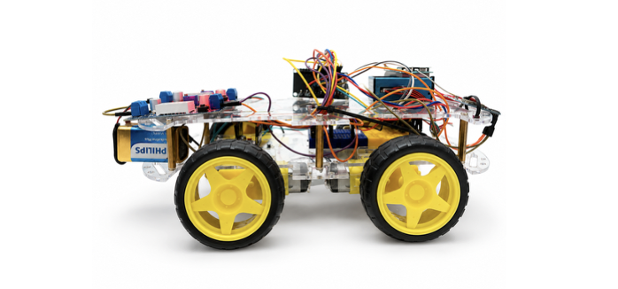
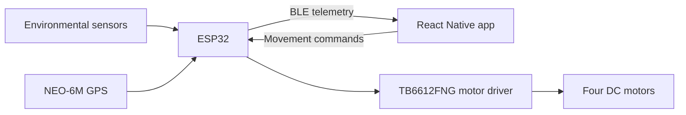

[README.md](https://github.com/user-attachments/files/32434775/README.md)
# ENROVER: IoT Air-Quality Monitoring Vehicle



ENROVER is a low-cost, mobile environmental-monitoring platform developed as my final-year Electronics and Computer Engineering project. It combines an ESP32-controlled four-wheel vehicle, environmental sensors, GPS and a React Native mobile application to collect and display location-based air-quality data.

The project explores whether a mobile IoT platform can provide useful, higher-resolution environmental measurements compared with relying only on fixed monitoring locations.

## Key features

- Live air-quality and environmental readings over Bluetooth Low Energy (BLE)
- Manual vehicle control: forward, reverse, left, right and emergency stop
- GPS position, route recording and map visualisation
- Colour-coded PM2.5 route segments
- Session analytics showing minimum, maximum, average and recent trends
- CSV export of collected sensor readings
- Connection status, GPS status and data-logging controls
- Support for both JSON and delimited BLE sensor messages

## System overview



The ESP32 gathers sensor and GPS measurements, sends telemetry to the mobile app and receives movement commands through a Nordic UART-style BLE service.

## Hardware

| Component | Purpose |
|---|---|
| ESP32 | Main controller and BLE communication |
| BME280 | Temperature, humidity and atmospheric pressure |
| SGP30 | Total volatile organic compounds and equivalent CO₂ |
| PMS5003 | PM1.0, PM2.5 and PM10 particulate measurements |
| NEO-6M GPS | Position and route information |
| TB6612FNG | Dual motor driver |
| Four DC motors | Vehicle movement |
| 9 V battery system and buck converters | Regulated system power |

## ESP32 pin configuration

| Connection | ESP32 pin |
|---|---:|
| I²C SDA | GPIO 21 |
| I²C SCL | GPIO 22 |
| GPS RX | GPIO 16 |
| GPS TX | GPIO 17 |
| Motor PWMA | GPIO 25 |
| Motor AIN1 | GPIO 26 |
| Motor AIN2 | GPIO 27 |
| Motor STBY | GPIO 33 |
| Motor BIN1 | GPIO 14 |
| Motor BIN2 | GPIO 12 |
| Motor PWMB | GPIO 13 |

## Mobile application

The application was built with React Native, Expo Router and TypeScript. It uses `react-native-ble-plx` for BLE communication.

### Dashboard

Displays live values for:

- Temperature
- Humidity
- Pressure
- TVOC
- eCO₂
- PM1.0
- PM2.5
- PM10
- GPS position and satellite status

### Vehicle controls

Provides directional movement controls, stop functionality, connection feedback and an emergency-stop control. An automatic patrol sequence is also available in the interface.

### GPS map

Displays the vehicle position and records route points when a GPS fix is available. Route segments are colour-coded using PM2.5 readings to help visualise changing air quality along the route.

### Analytics

Maintains a limited in-memory history of readings and displays recent trends alongside minimum, maximum and average values for each measurement.

### Settings and export

Shows connection and session information and allows collected readings to be exported as CSV data.

## Repository structure

```text
.
├── app/
│   ├── BluetoothContext.tsx
│   ├── _layout.tsx
│   └── (tabs)/
│       ├── index.tsx
│       ├── control.tsx
│       ├── map.tsx
│       ├── analytics.tsx
│       └── settings.tsx
├── assets/
├── components/
├── constants/
├── hooks/
├── images/
│   └── enrover-vehicle.png
├── firmware/                 # ESP32 firmware when added
├── app.json
├── package.json
├── package-lock.json
└── tsconfig.json
```

## Running the mobile app

### Requirements

- Node.js and npm
- Expo development environment
- A compatible iOS or Android device with Bluetooth enabled
- A development build that supports `react-native-ble-plx`

### Installation

```bash
git clone <your-repository-url>
cd ENROVER-Air-Quality-Monitoring-Robot
npm install
npx expo start
```

Because the app uses native BLE functionality, Expo Go alone may not support every feature. Use an appropriate development build for full Bluetooth operation.

## BLE communication

The app searches for the ENROVER device, connects to its Nordic UART-style service, subscribes to sensor notifications and sends encoded movement commands to the ESP32.

The interface accepts incoming telemetry in JSON or key-value format, normalises sensor names and updates the live dashboard, analytics history and recorded route.

## Evaluation

The completed prototype successfully demonstrated:

- Collection of environmental and particulate measurements
- BLE communication between the ESP32 and mobile application
- Remote vehicle movement controls
- Live monitoring through the mobile dashboard
- Session analytics and CSV export
- GPS-based mapping when a valid outdoor fix was available

Stationary and mobile trials produced broadly comparable environmental readings with minor variations caused by movement and changing local conditions. The platform also responded to pollution sources such as vehicle emissions and cigarette smoke during controlled demonstrations.

## Limitations

- Low-cost sensors require calibration against reference instruments for authoritative measurements.
- Movement, airflow, sensor placement and environmental conditions can affect readings.
- GPS reception is unreliable indoors and may require time outdoors to obtain a fix.
- The prototype is not a regulatory-grade air-quality monitoring instrument.
- Automatic patrol is an experimental control sequence, not full obstacle-aware autonomous navigation.
- Current route and sensor histories are held in memory during an app session.

## Future development

- Calibrate sensors against a trusted reference station
- Add obstacle detection and closed-loop autonomous navigation
- Store measurements persistently in a local or cloud database
- Add a full heat-map layer and longer route-history support
- Improve power management and weather protection
- Conduct repeated outdoor trials across different routes and conditions

## Author

**Imaan Soliman**  
Electronics and Computer Engineering graduate and MSc Robotics student.

## Disclaimer

This repository documents an educational engineering prototype. Its measurements should not be used for health, regulatory or safety-critical decisions.
